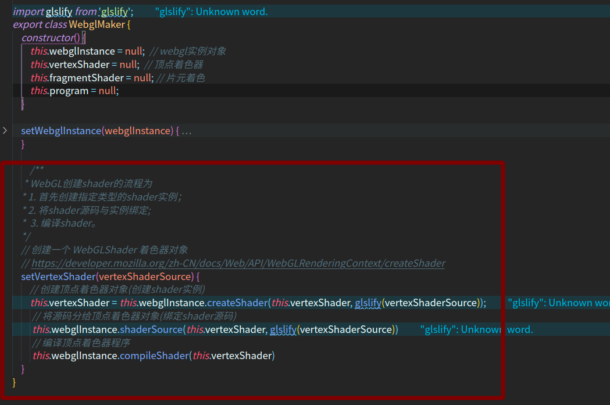
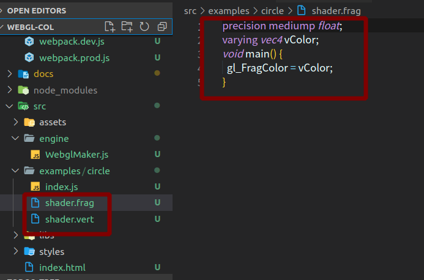
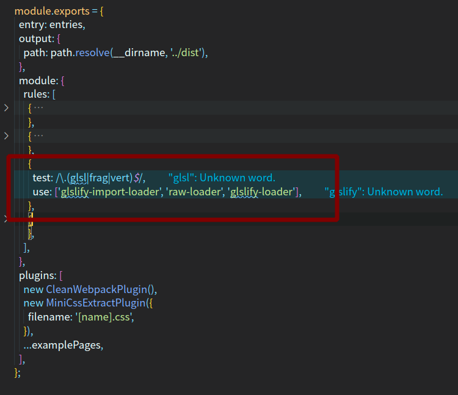

#! https://zhuanlan.zhihu.com/p/403527235
<!--
 * @Author: your name
 * @Date: 2021-08-25 17:50:52
 * @LastEditTime: 2021-08-26 15:31:29
 * @LastEditors: Please set LastEditors
 * @Description: In User Settings Edit
 * @FilePath: /webgl-col/docs/WebGL创建shader的流程.md
-->
WebGL创建shader的流程为：

1. 首先创建指定类型的shader实例；
2. 将shader源码与实例绑定;
3. 编译shader。


```javascript

const source = `
precision mediump float;

attribute vec2 a_pos;

uniform vec4 u_color;
uniform vec2 u_resolution;
uniform vec2 u_translate;

varying vec4 v_color;

void main() {
    vec2 real_poistion = (a_pos+u_translate) / u_resolution * 2.0 - 1.0;
    gl_Position = vec4(real_poistion * vec2(1, 1), 0, 1);
    v_color = u_color;
}`;
// 创建shader实例
const Shader = gl.createShader(gl.VERTEX_SHADER);
// 绑定shader源码
gl.shaderSource(Shader,source);
// 编译
gl.compileShader(Shader);
```
shader的源码以字符串的形式绑定至shader实例，也就是说，不论shader的源码是用什么编程语言编写（比如可以按照上述代码中用JavaScript字符串编写，也可以直接用glsl语言编写），一定要保证以字符串的形式引入shader源码模块。秉承这项原则，最简单的shader构建方案便是上述代码中的字符串形式

这种书写方式优点是不需要对Webpack进行任何配置，但是却等于放弃了IDE对glsl语法的高亮、纠错等辅助功能。如果shader源码只有几行倒也没什么大问题，但是对于几十上百行的代码如果没有高亮辅助的话可能会严重影响开发效率。

解决这个问题的办法要从两方面入手：

- 令Webpack能够正确编译glsl代码；
- 令TypeScript能够将glsl模块与ts模块融合。


<b>glsl语言方式构建</b>






把glsl模块引入到js模块中并且作为字符串使用，所以Webpack要做的就是将glsl源码构建为字符串即可：

```javascript

{
  test: /\.glsl$/,
  loader: 'raw-loader'
}
```
raw-loader的功能是将被引入的文件内容转换为字符串。




# reference

https://github.com/JXtreehouse/demo_ts-webgl-webpack

[Typescript + WebGL + Webpack development environment to build](https://titanwolf.org/Network/Articles/Article?AID=bef3a8b7-0744-40ed-959d-c06c4c54fab0#gsc.tab=0)

