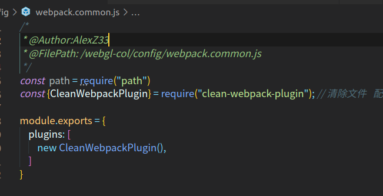

<!--
 * @Author: your name
 * @Date: 2021-08-24 17:39:39
 * @LastEditTime: 2021-08-24 17:44:09
 * @LastEditors: Please set LastEditors
 * @Description: In User Settings Edit
 * @FilePath: /webgl-col/docs/webpack 4.0 中 clean-webpack-plugin.md
-->
其实 clean-webpack-plugin 很容易知道它的作用，就是来清除文件的。

一般这个插件是配合 `webpack -p `这条命令来使用，就是说在为生产环境编译文件的时候，先把 build或dist (就是放生产环境用的文件) 目录里的文件先清除干净，再生成新的。

